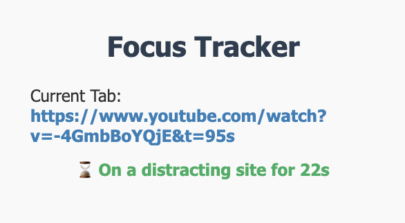
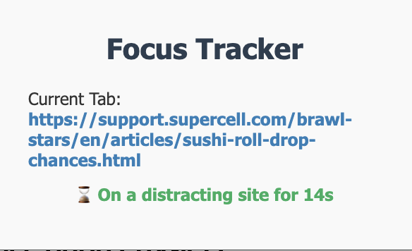
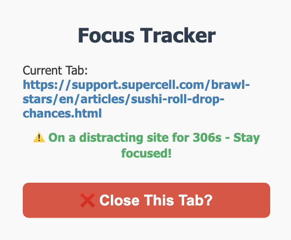
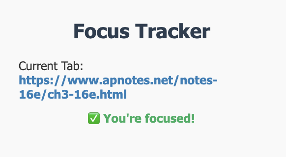
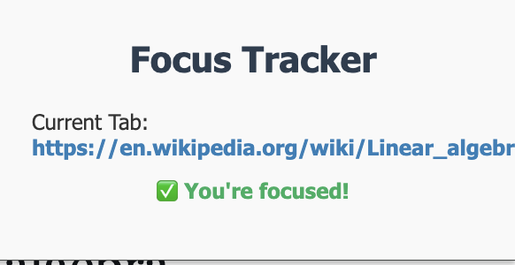

# Focus Tracker - Chrome Extension

**Focus Tracker** is a Chrome extension that helps you stay productive by detecting when you're on distracting websites. It uses an AI-powered text classifier to analyze the current page content and alert you when you're losing focus.

## Features

- Detects when you're on a distracting website
- Uses AI via Flask to analyze visible webpage text
- Tracks how long you've been on a distracting site
- Sends a notification with an option to close the tab
- Displays current site status in the popup

## Files Overview

- `manifest.json` — Chrome extension config
- `content.js` — Extracts visible text and communicates with the text classifier
- `popup.js` — Displays site status and link and allows user interaction for tab close
- `background.js` — Tracks tab distraction time and sends notifications if over 5 mins
- `icon*.png` — Extension icons
- `app.py` - Flask app

## Setup Instructions

### 1. Load the Extension in Chrome

1. Go to `chrome://extensions/`
2. Enable **Developer mode** 
3. Click **Load unpacked**
4. Select the folder containing focus tracker

### 2. Start Your Local AI Server

Load Server using render or other servers

## Focus Tracker in use

### Distracting Sites

### Tab close feature

### Non Distracting Sites

##### License

MIT

